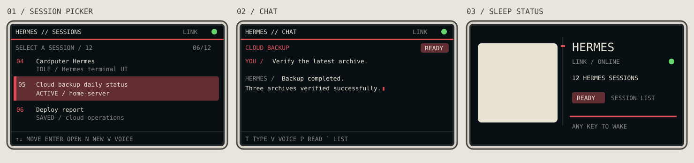

<div align="center">
  
  <h1>Cardputer Hermes Terminal</h1>
  <p><strong>A native pocket terminal for Nous Research Hermes Agent.</strong></p>
  <p>Sessions, chat, voice, spoken replies, status, and administration — directly from an M5Stack Cardputer ADV.</p>

  [](https://github.com/m0rg0t/cardputer-hermes-terminal/actions/workflows/ci.yml)
  [](https://m0rg0t.github.io/cardputer-hermes-terminal/)
  [](LICENSE)
  
</div>



Cardputer Hermes Terminal is a purpose-built ESP32-S3 client for a self-hosted Hermes Agent Dashboard. It reproduces the Desktop connection flow on-device: authenticate over REST, request a short-lived WebSocket ticket, then connect to Hermes directly — without a relay service or notes recorder.

## What it does

- Browse, create, and resume Hermes sessions.
- Send keyboard messages or record a voice prompt.
- Read the latest Hermes reply and optionally play it with TTS.
- Show explicit connecting, loading, ready, and error states.
- Cancel slow session loads instead of locking the interface.
- Open Help, Settings, and Status with a long press of the Go button.
- Configure Wi-Fi and Hermes from the SD card or local admin panel.
- Display a flicker-free Hermes portrait sleep screen with status.
- Preserve the M5Apps launcher by flashing only the application slot.

The visual language borrows from late Shōwa and early Heisei portable electronics: dark graphite panels, warm-white type, precise red accents, and small status lamps — adapted for a readable 240×135 display.

## Quick start

### 1. Build the firmware

Requirements: PlatformIO 6.1+, Python 3.10+, and a Cardputer ADV.

```bash
git clone git@github.com:m0rg0t/cardputer-hermes-terminal.git
cd cardputer-hermes-terminal
platformio run
```

The application image is produced at `.pio/build/cardputer-adv-hermes/firmware.bin`.

### 2. Prepare the SD card

```bash
cp sdcard/HERMES.CFG.example /Volumes/YOUR_SD/HERMES.CFG
```

Minimum configuration:

```ini
wifi_ssid=YOUR_WIFI
wifi_password=YOUR_WIFI_PASSWORD
hermes_base_url=https://hermes.example.com
auth_mode=password
hermes_username=YOUR_USERNAME
hermes_password=YOUR_PASSWORD
```

`HERMES.CFG`, certificates, recordings, and flash backups are ignored by Git. Never commit credentials.

### 3. Install safely

> [!IMPORTANT]
> `firmware.bin` is an **application image**, not a full-device image. Never write it at address `0x000000`; doing so overwrites the bootloader and M5Apps launcher.

```bash
./scripts/flash_hermes_m5apps.sh /dev/cu.usbmodemNNNN
```

The installer checks the chip, partition layout, image size, and target offset before writing. See [Safe flashing](docs/SAFE_FLASHING.md) for the recovery-safe workflow.

## Controls

| Context | Key | Action |
|---|---|---|
| Session list | `↑` / `↓` | Select a session |
| Session list | `Enter` | Open selected session |
| Session list | `N` | New text session |
| Session list | `V` | New session from voice |
| Terminal | `T` | Type a message |
| Terminal | `V` | Record a voice message |
| Terminal | `R` | Read the latest Hermes reply |
| Terminal | `S` | Steer / interrupt |
| Anywhere | `Esc` | Back or cancel active loading |
| Anywhere | Long-press Go | Help, Settings, and Status |

See the full [Keyboard reference](docs/KEYBOARD_REFERENCE.md).

## Documentation

| Guide | Purpose |
|---|---|
| [Getting started](docs/GETTING_STARTED.md) | Build, SD preparation, first connection |
| [Configuration](docs/CONFIGURATION.md) | Wi-Fi, authentication, TLS, audio, admin panel |
| [Safe flashing](docs/SAFE_FLASHING.md) | Install without overwriting M5Apps |
| [Keyboard reference](docs/KEYBOARD_REFERENCE.md) | Every screen and shortcut |
| [Architecture](docs/ARCHITECTURE.md) | Firmware modules and connection flow |
| [Hermes protocol notes](docs/HERMES_PROTOCOL.md) | Dashboard REST and WebSocket behavior |
| [Device test plan](docs/DEVICE_TEST_PLAN.md) | Hardware acceptance checklist |
| [Release checklist](docs/RELEASE_CHECKLIST.md) | Repeatable release process |

## Authentication model

```text
credentials or session cookie
        ↓
authenticated REST session
        ↓
POST /api/auth/ws-ticket
        ↓
single-use 30-second ticket
        ↓
WSS /api/ws?ticket=…
```

Use HTTPS for any network you do not fully trust. Plain HTTP credentials are disabled unless explicitly allowed in configuration.

## Project boundaries

This is a focused Hermes terminal. It does not record notes, proxy conversations through a custom cloud service, or replace Hermes Agent itself. The optional local web panel is limited to device configuration and diagnostics.

## Contributing

Bug reports, protocol findings, UI refinements, and hardware testing are welcome. Read [CONTRIBUTING.md](CONTRIBUTING.md) before opening a pull request. Please report security concerns using [SECURITY.md](SECURITY.md).

## Credits and license

Hermes Agent is developed by [Nous Research](https://github.com/NousResearch). M5Stack and Cardputer are trademarks of their respective owners. This independent client is not an official Nous Research or M5Stack product.

Released under the [MIT License](LICENSE).
