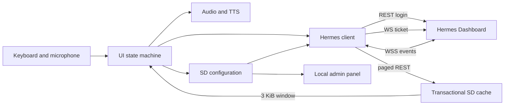

# Architecture

The firmware is a direct Hermes Dashboard client optimized for a small ESP32-S3
device. It does not introduce a companion relay. Its SD copy is a bounded,
replaceable read cache; Hermes remains the source of truth.

## Connection lifecycle

1. Load configuration and initialize hardware.
2. Join Wi-Fi.
3. Reuse a configured cookie or authenticate with credentials.
4. Request a short-lived, single-use ticket from `/api/auth/ws-ticket`.
5. Upgrade to `/api/ws?ticket=…`.
6. Fetch sessions and subscribe to live events.
7. Refresh authentication and reconnect with bounded backoff when needed.

Every long operation is represented in the UI state machine. Session loading and connection attempts remain cancellable, and failures retain their stage and HTTP/TLS/WebSocket detail for Status.

## Cache lifecycle

- The session index is fetched in pages and committed only after the final page.
- History is fetched oldest-first into paired `.jsonl` and pre-rendered `.view`
  staging files. A transaction marker and backups prevent mixed generations.
- Large JSON strings are decoded from the REST file directly into 512-byte SD
  records. They are never materialized as a full Arduino `String`.
- The UI reads at most 3 KiB around the current scroll position.
- CRC32 and byte counts protect both cache files. A mismatch quarantines the
  pair for a clean re-download.
- Live assistant deltas flush to a spool after 512 bytes or 250 ms. A reset can
  recover the interrupted partial response.
- The quota evicts the least-recently-opened session and never evicts the active
  session.

## Rendering and audio

Regular screens use a stable framebuffer and dirty-region updates. Sleep blinking changes only eye pixels at a fixed origin. The recorder temporarily owns the audio peripherals, finalizes the upload, then mutes and releases the speaker path; TTS uses the same serialized ownership model.

## Trust boundaries

- SD card: Wi-Fi, Hermes credentials, optional private CA, preferences.
- RAM: active cookie, one-time ticket, current 3 KiB timeline window.
- Hermes Dashboard: authoritative session and message history.
- Local admin: configuration and diagnostics; secrets are never returned in full.

See [Hermes protocol notes](HERMES_PROTOCOL.md) for endpoint behavior.
