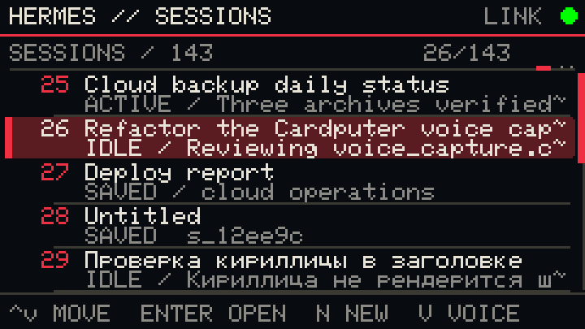
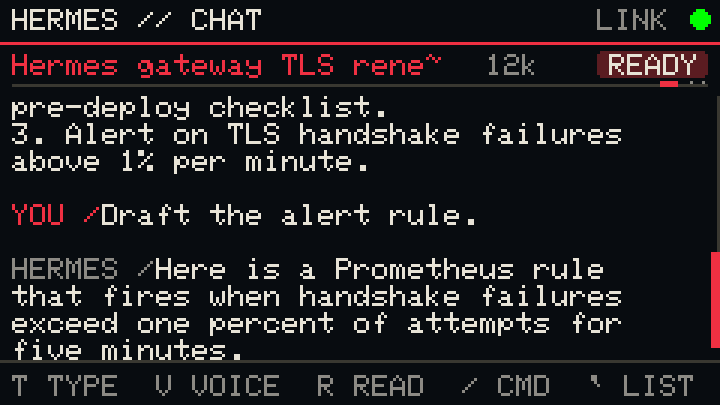
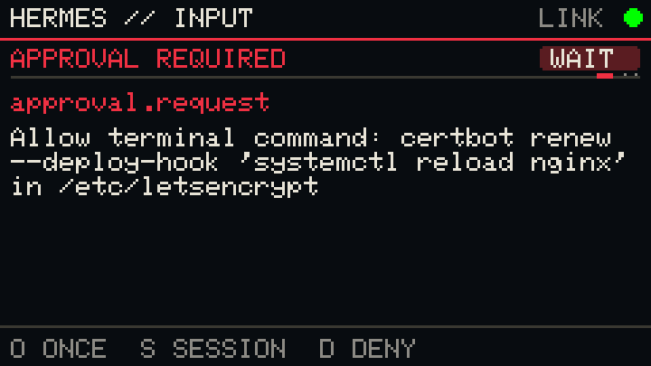
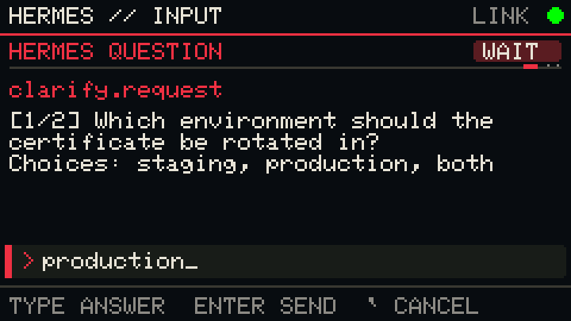
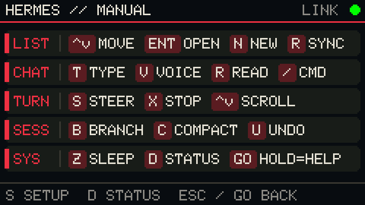
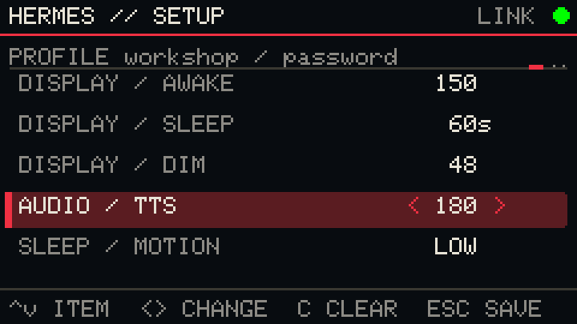
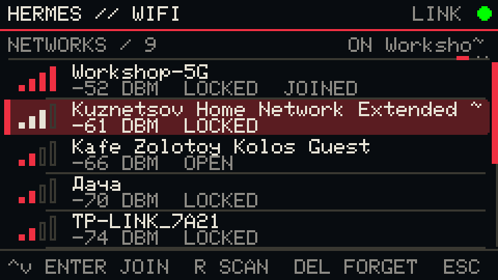
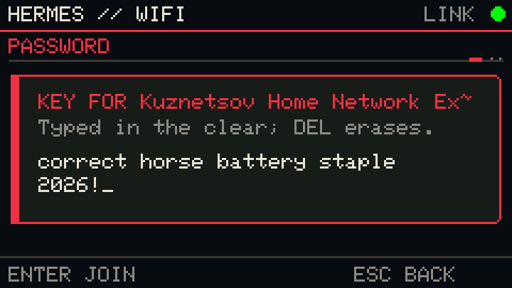

# Keyboard reference

Available actions are repeated in the bottom command rail on each screen, and
the on-device manual (long-press Go) lists every group. Screens below are the
real renders from the [desktop preview](../sim/README.md).

## Global

| Key | Action |
|---|---|
| `Esc` | Back; cancel connecting or loading when possible |
| `↑` / `↓` | Move selection or scroll |
| `←` / `→` | Change the selected setting |
| `Enter` | Open, confirm, or send |
| `Z` | Sleep screen (session list and terminal) |
| Long-press Go | Open Help / Settings / Status; press again to return |

## Session list

| Key | Action |
|---|---|
| `↑` / `↓` | Select session; pages through the SD cache at the ends |
| `Enter` | Load selected session (cached transcript opens even offline) |
| `N` | Create a text-first session |
| `V` | Create a session from a voice prompt |
| `R` | Refresh sessions (reconnect when offline) |
| `D` | Status page |
| `Esc` | Cancel a running session sync |

## Terminal

| Key | Action |
|---|---|
| `T` | Open text composer |
| `V` | Record and send voice; `V` again or `Enter` sends, `Esc` cancels |
| `R` / `P` | Speak the latest Hermes reply (TTS) |
| `/` | Open the composer with a slash command |
| `S` | Steer the running turn |
| `X` | Stop the running turn |
| `B` / `C` / `U` | Branch, compact, or undo the session |
| `↑` / `↓` | Scroll transcript; older cached history loads at the top |
| `Del` | Discard a failed voice recording (when `V RETRY` is offered) |
| `Esc` | Return to the list, or cancel pending work |

## Hermes questions

 

Approval requests show only the choices Hermes offered (`O` once, `S` session,
`A` always, `D` deny). Clarify, sudo, and secret requests show the typed
answer on the screen; secrets are masked.

## Help, Settings, Status

 

| Key | Action |
|---|---|
| `S` / `D` / `H` | Switch between Setup, Status, and Manual |
| `↑` / `↓` | Select a setting |
| `←` / `→` | Change the selected value (saved when the panel closes) |
| `C`, `C` | Erase the offline cache (confirmation shown in the footer) |
| `M` / `K` | Microphone test / speaker test (Status page) |
| `R` | Force a reconnect (Status page) |
| `W` | Wi-Fi: scan, join, and save a network (default profile) |

## Wi-Fi

 

| Key | Action |
|---|---|
| `↑` / `↓` | Select a network (strongest first, `JOINED` / `SAVED` marked) |
| `Enter` | Join; `SAVED` networks use their stored key, others ask for it |
| `R` | Scan again |
| `Del` | Forget the selected learned network |
| `Esc` | Back to Setup, or cancel a scan or join in progress |

The Status page explains the header indicators: the lamp is green when the
Hermes link is up and orange otherwise; the plate reads `READY`, `WORK`,
`TOOL`, `WAIT`, or `ERR`.
